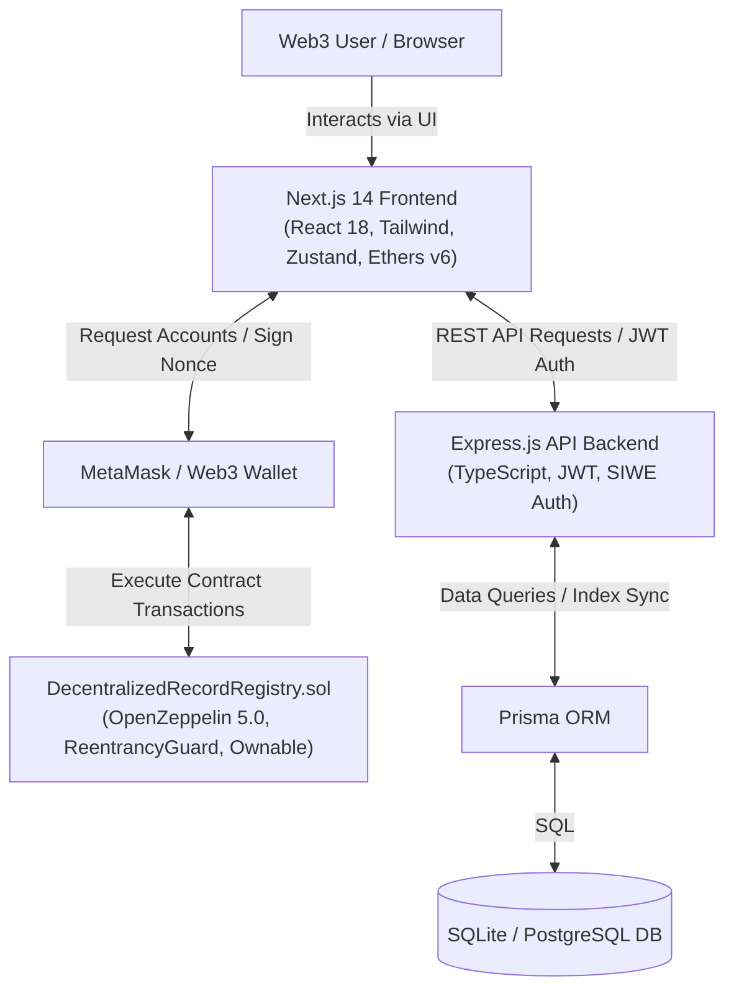
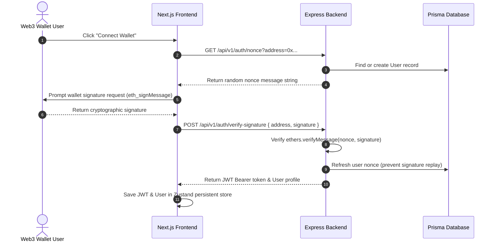

# System Architecture & Technical Specifications

The **CipherVault Web3 Record Registry** is built using a **Clean Architecture** model, enforcing strict separation of concerns across on-chain contract logic, off-chain indexing services, and frontend state management.

---

## High-Level Architecture Diagram

---

## Core Components Breakdown

### 1. Smart Contract Layer (`DecentralizedRecordRegistry.sol`)
- **Immutability & Safety**: Built with Solidity `0.8.24`. Inherits OpenZeppelin `Ownable` for contract admin operations and `ReentrancyGuard` to defend against reentrant state manipulation.
- **Gas Optimization**: Custom errors (`RecordNotFound`, `NotRecordOwner`, `InvalidInput`, `RecordAlreadyExists`, `RecordIsInactive`) save up to 20,000 gas per revert compared to string `require()` statements.
- **NatSpec Documentation**: Full NatSpec comments `@notice`, `@dev`, `@param`, `@return` on all functions.
- **Event Logging**: Emits `RecordCreated`, `RecordUpdated`, and `RecordDeleted` indexed events.

### 2. Authentication Flow (SIWE - Sign-In With Ethereum)

### 3. Off-Chain Indexing & Caching Strategy
- Reading raw contract arrays over JSON-RPC can become slow with thousands of entries.
- The Express backend operates an indexer sync endpoint (`POST /api/v1/records/sync`) which caches on-chain records into a fast relational database (`RecordCache` table in Prisma).
- Frontend queries indexed records for Instant Full-Text Search, Category Filtering, and Pagination, while verifying record state directly against smart contract getters.

---

## Security Audit Safeguards

1. **Reentrancy Protection**: All state-modifying contract functions (`createRecord`, `updateRecord`, `deleteRecord`) are guarded with OpenZeppelin `nonReentrant`.
2. **Access Control**: Record updates and soft deletions verify `record.owner == msg.sender` before mutating storage.
3. **Replay Attack Prevention**: Nonces are invalidated immediately upon successful wallet signature verification.
4. **CORS & Helmet Protection**: Express API uses security headers via `helmet()` and strict CORS domain whitelisting.
